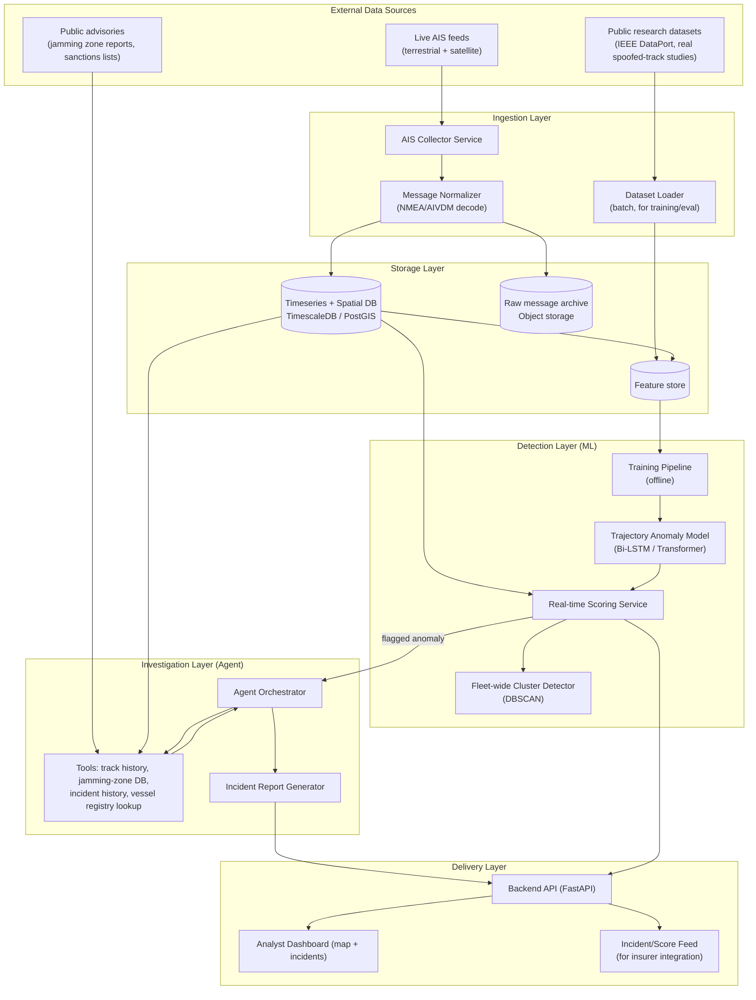
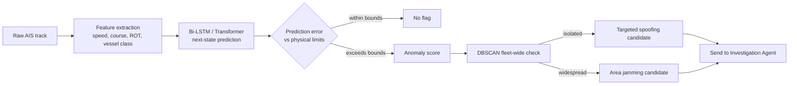
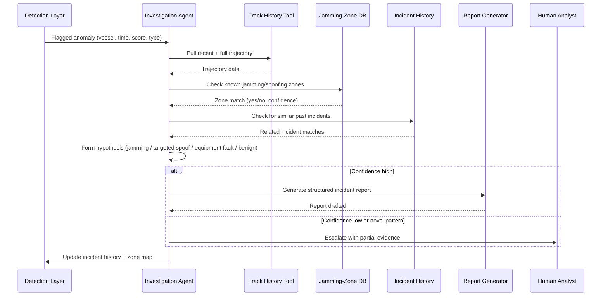
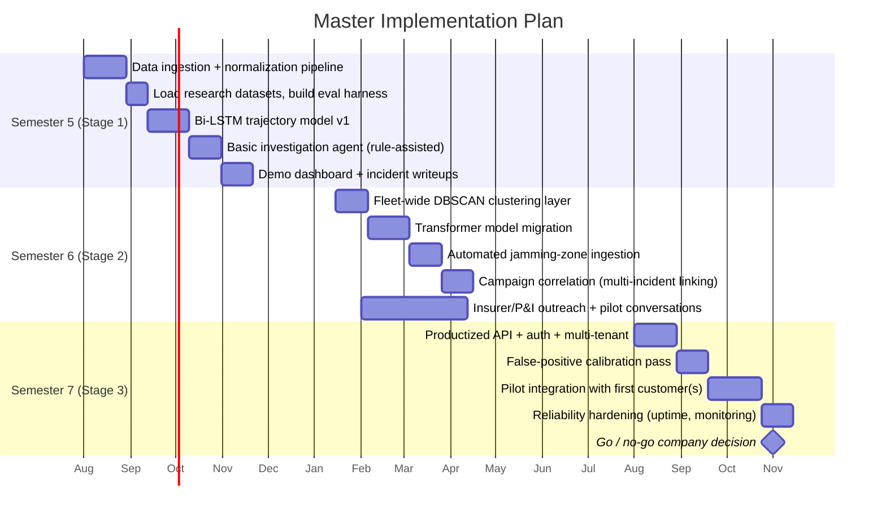

# AIS/GNSS Spoofing Threat Intelligence Platform
## High-Level Design and Master Implementation Plan

Status: accepted proposal, entering Stage 1 (Semester 5)
Owners: 3-person founding team
Companion doc: `ais-gnss-threat-intel-proposal.md` (business case, market, competitive landscape)

---

## 1. Purpose of this document

This document translates the accepted proposal into something buildable: a system architecture, a concrete tech stack, a repo layout, and a week-by-week master implementation plan across all three semesters. Every design decision below is chosen specifically to answer the open questions and limitations raised in the proposal (data access, false positives, agent quality, evaluation rigor), not just to look complete.

---

## 2. System overview

The system has four layers that map directly onto the ML/agentic/business requirements from the proposal:

1. **Ingestion layer** - pulls real AIS data continuously from public sources, plus loads labeled research datasets for training/evaluation.
2. **Detection layer (ML)** - trajectory-anomaly models that score incoming vessel tracks for spoofing likelihood.
3. **Investigation layer (agent)** - a bounded, tool-using agent that takes a flagged anomaly and turns it into an evidence-backed incident report.
4. **Delivery layer** - the API, dashboard, and incident feed that a marine insurer or fleet operator actually consumes.



---

## 3. Detection layer design (the ML)

### 3.1 What it predicts
Given a vessel's recent AIS track (position, speed over ground, course over ground, heading, rate of turn) and its declared vessel class, the model predicts the next plausible state. A large deviation between predicted and reported state, beyond what the vessel's real physical limits allow, is the core spoofing signal.

### 3.2 Model progression across stages
- **Stage 1:** Bi-LSTM sequence model, trained and validated against the real-vs-simulated spoofed-track research and the IEEE DataPort synthetic GPS spoofing dataset. Target: reproduce published precision/recall in the 0.9+ range as a credible baseline.
- **Stage 2:** add the fleet-wide DBSCAN clustering layer to separate "many vessels affected at once" (area jamming) from "one vessel affected" (targeted spoofing or deliberate manipulation), and begin migrating the core model toward a transformer-based trajectory model for longer-range context.
- **Stage 3:** continuous retraining pipeline against the growing incident history, plus a calibration layer that explicitly tunes for false-positive rate, since that is the metric the insurer buyer will actually judge you on.



---

## 4. Investigation layer design (the agent)

This is the layer that satisfies the agentic requirement directly: it does bounded, evidence-gathering security work, not open-ended chat.

### 4.1 Agent workflow



### 4.2 Agent design principles (carried over directly from the proposal)
- The agent never auto-declares "this is spoofing." It produces a scored hypothesis with evidence attached.
- Escalation is driven by confidence, not raw anomaly magnitude, which is the specific fix for the false-positive risk named in the proposal's limitations section.
- Every agent action (which tool it called, what it found) is logged, so the incident report is auditable, not a black box, which matters a great deal to an insurer buyer.
- The agent's own outputs feed back into the jamming-zone DB and incident history, so the system gets better at recognizing recurring patterns over time without manual retraining every time.

---

## 5. Data strategy (directly answering the "no data" objection)

| Source | What it gives us | Access pattern |
|---|---|---|
| Public terrestrial/satellite AIS feeds | Real, live vessel tracks | Free public feeds for Stage 1 scale; evaluate commercial satellite-AIS licensing terms before Stage 3 scale-up |
| IEEE DataPort synthetic GPS spoofing dataset | Labeled ground truth for training/eval | Public research dataset |
| Real-vs-simulated spoofed AIS track studies | Additional labeled/benchmarked cases | Public research literature |
| Public maritime advisories, known jamming zone reports | Seed data for the jamming-zone DB | Public sources, manually curated at Stage 1, automated ingestion by Stage 2 |
| Our own accumulating incident history | Growing proprietary dataset over time | Generated by the system itself once running - this becomes the long-term data moat |

This is the same three-pattern approach from our earlier research pass: public real-time telemetry, public labeled research data, and a self-generated data moat over time. No vessel access, no insurer data, and no proprietary industry relationship is required to reach a working Stage 1.

---

## 6. Tech stack

| Layer | Choice | Why |
|---|---|---|
| Ingestion | Python service consuming public AIS feed(s), `pyais` for AIVDM/NMEA decoding | Mature, well-documented decoding library; keeps ingestion simple and swappable |
| Message queue (Stage 2+) | Kafka or Redpanda | Only needed once ingestion volume grows past Stage 1; keeps ingestion decoupled from scoring |
| Storage | TimescaleDB (Postgres + PostGIS extension) | Native spatio-temporal queries on vessel tracks, one database instead of juggling separate time-series and geo stores |
| Raw archive | S3-compatible object storage | Cheap, durable raw-message retention for reprocessing/retraining |
| ML framework | PyTorch | Standard for sequence models (Bi-LSTM, transformer); large community support for trajectory-prediction literature we are reproducing |
| Classical ML | scikit-learn | DBSCAN clustering, quick baselines |
| Experiment tracking | MLflow | Reproducible comparison against published baselines, required for the "measurable evaluation" requirement |
| Agent orchestration | LangGraph (or a custom bounded state machine if LangGraph feels heavier than needed) | Explicit, inspectable agent state and tool-calling, not a free-form chat loop; matches the "bounded, escalating, auditable" design principle |
| LLM for agent reasoning | Claude (Sonnet-class) via API | Strong tool-use and structured-output reliability for report generation |
| Backend API | FastAPI (Python) | Fast to build, async-friendly for real-time scoring endpoints, same language as the ML stack |
| Frontend dashboard | React + a map layer (MapLibre GL or Deck.gl) | Vessel-track and incident visualization is the natural way to demo and to actually use this day to day |
| Auth/multi-tenant (Stage 3) | Standard OAuth2/JWT, per-customer API keys | Needed once you have more than one pilot customer on the feed |
| CI/CD | GitHub Actions | Free, integrates directly with the repo you are pushing this into |
| Containerization | Docker + docker-compose (Stage 1-2), migrate to a managed orchestrator only if/when Stage 3 scale requires it | Keep infrastructure complexity proportional to actual need each stage |
| Infra as code (Stage 3) | Terraform | Only introduced once there is a real deployment to manage, not before |

---

## 7. Repository structure

```
ais-threat-intel/
  data/
    raw/                  # archived raw AIS messages (gitignored, points to object storage)
    research_datasets/    # IEEE DataPort + published labeled datasets
    jamming_zones/        # curated + auto-updated known jamming/spoofing zone data
  ingestion/
    collector/            # live AIS feed consumer
    normalizer/           # AIVDM/NMEA decoding, schema normalization
  ml/
    features/             # feature extraction pipeline
    models/
      bilstm/             # Stage 1 model
      transformer/        # Stage 2+ model
      clustering/         # DBSCAN fleet-wide detector
    training/              # training scripts, MLflow configs
    evaluation/            # benchmark scripts against published baselines
  agent/
    orchestrator/         # LangGraph / state machine definition
    tools/                 # track_history.py, jamming_zones.py, incident_history.py
    report_generator/     # structured incident report drafting
  backend/
    api/                   # FastAPI app: scoring endpoint, incident feed, dashboard data
    models/                 # DB schema, ORM models
  frontend/
    dashboard/              # React app: map view, incident list, vessel drill-down
  infra/
    docker/                 # Dockerfiles, docker-compose.yml
    terraform/               # (Stage 3) IaC for cloud deployment
    ci/                        # GitHub Actions workflows
  docs/
    HLD_and_Master_Implementation_Plan.md   # this document
    ais-gnss-threat-intel-proposal.md        # business case and proposal
    research_notes/                            # consensus/red-team findings as they come in
  notebooks/
    exploration/                                 # data exploration, model prototyping
```

---

## 8. Master implementation plan

### 8.1 Timeline overview



### 8.2 Semester 5 (Stage 1) - detailed milestones

**Weeks 1-4: Ingestion and normalization**
- Stand up the AIS collector against a public feed.
- Build the AIVDM/NMEA normalizer and land clean records into TimescaleDB.
- Deliverable: a running pipeline continuously ingesting real, live vessel tracks.

**Weeks 5-6: Evaluation harness**
- Load the IEEE DataPort synthetic spoofing dataset and the real-vs-simulated spoofed track research data.
- Build the evaluation harness (precision, recall, F1) so every model iteration from here on has a number attached.
- Deliverable: a reproducible benchmark script anyone on the team can run.

**Weeks 7-10: Detection model v1**
- Train the Bi-LSTM trajectory model.
- Benchmark against the published baselines from the literature.
- Deliverable: a model that reproduces credible published-level detection performance, tracked in MLflow.

**Weeks 11-13: Investigation agent v1**
- Build the orchestrator with three tools: track history, a hand-curated jamming-zone list, and a (currently small) incident history.
- Wire it to generate structured incident reports for flagged anomalies.
- Deliverable: an end-to-end flow from raw anomaly to a readable, evidence-backed incident report.

**Weeks 14-16: Dashboard and Stage 1 writeup**
- Build the minimal dashboard: map view, incident list, drill-down per vessel.
- Assemble the Stage 1 report: architecture, benchmark results, sample incident reports, and the proposal's business case, packaged as the Semester 5 deliverable.
- Deliverable: a complete, demoable Semester 5 project satisfying every one of the professor's Stage 1 requirements.

### 8.3 Semester 6 (Stage 2) - detailed milestones
- Add fleet-wide DBSCAN clustering to distinguish area jamming from targeted spoofing.
- Migrate the core detector toward a transformer-based model for richer context.
- Automate jamming-zone ingestion from public advisories instead of hand-curating.
- Build campaign correlation: linking related incidents into a single ongoing narrative.
- Run the consensus/red-team pass from the proposal's appendix if not already done, specifically to close the CYTUR and AIS-data-licensing questions before scaling further.
- Begin informal outreach to two or three marine insurers or P&I clubs, explicitly to gather real feedback before Stage 3 design is locked in.

### 8.4 Semester 7 (Stage 3) - detailed milestones
- Harden the API for multi-tenant, real customer use: auth, per-customer API keys, rate limiting.
- Run a dedicated false-positive calibration pass, treating it as a first-class metric per the proposal's limitations section, not an afterthought.
- Integrate with at least one pilot customer's actual workflow.
- Add reliability engineering: monitoring, alerting, uptime tracking, since a product an insurer depends on cannot silently go down.
- Make the explicit go/no-go call on pursuing this as a real company, backed by real pilot feedback rather than assumption.

---

## 9. Risks and mitigations, mapped to design decisions

| Risk (from the proposal) | Mitigation, and where it lives in this design |
|---|---|
| No data access to real vessels/insurers | Public AIS feeds + public research datasets cover Stage 1 entirely; see Section 5 |
| False positives undermine insurer trust | Confidence-driven escalation in the agent (Section 4.2) + a dedicated Stage 3 calibration milestone (Section 8.4) |
| CYTUR or another incumbent already covers this | Consensus/red-team prompt from the proposal, scheduled explicitly in Semester 6 (Section 8.3), before further scaling |
| AIS data licensing restrictions at commercial scale | Explicitly flagged for evaluation before Stage 3 scale-up (Section 5); Stage 1-2 stay within free public-feed limits |
| Agent becomes "just a chatbot" instead of real investigative work | Bounded tool-calling, auditable action log, confidence-based escalation, all specified in Section 4 |
| Distinguishing spoofing from ordinary GPS/equipment degradation | Explicit hypothesis space in the agent (jamming / targeted spoof / equipment fault / benign) rather than a binary flag (Section 4.1) |

---

## 10. What happens after this document

This file, plus the proposal it builds on, are meant to live in `docs/` in the repo from day one, so the reasoning behind every architectural choice stays visible to the team (and to your professor) as the project evolves. Once this is pushed, the natural next steps are: kick off Week 1 of the Semester 5 plan, and optionally run the consensus/red-team prompt in parallel rather than waiting for Semester 6, if you want those unknowns closed before you're deep into the build.
