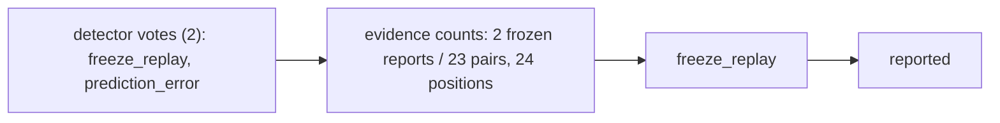

# GHAST // INCIDENT BRIEF  
> `freeze_replay` · `80%` · `reported`

**MMSI:** 219015298 · **Flagged:** 2026-09-28 19:41:47.376933+00:00 · **Score:** 0.8084  

## Signal  
GHAST flagged a possible **freeze‑replay** anomaly combined with a **prediction error** based on detector votes and a matched freeze‑corroboration (2 frozen reports out of 23 AIS pairs).

## Evidence  
- **Detector corroboration:** votes for “freeze_replay” and “prediction_error” (2 votes total).  
- **Freeze / jamming / history findings:** freeze‑corroboration matched = true (2 frozen reports, 23 total pairs); jamming zones not matched.  
- **Bounded track summary:** 24 AIS positions recorded.  
  - First position @ 13:46:53 UTC – lat 51.89679, lon 4.43315, SOG 0.0 kn, COG 104.1°.  
  - Last position @ 19:45:10 UTC – lat 51.90162, lon 4.43244, SOG 6.7 kn, COG 303.3°.

## Analyst action  
1. **Request the next AIS transmission window** for the vessel to verify whether the track resumes normal reporting or exhibits further freezes.  
2. **Cross‑check with radar or VMS data** (if available) covering the same time window to confirm vessel motion independent of AIS.  
3. **Continue automated monitoring** for repeat freeze‑replay signatures on this MMSI and flag any recurrence for escalation.  

*Evidence is limited to AIS‑based freeze detection; without corroborating sensor data, escalation is not warranted at this stage.*
